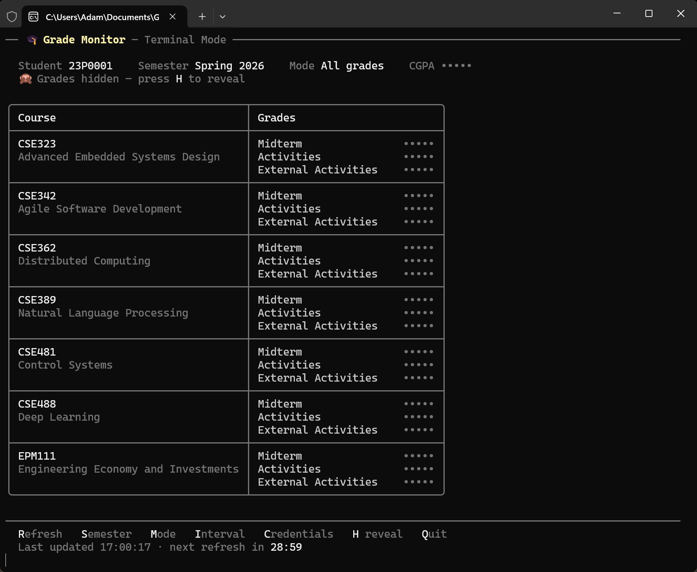

## :mortar_board: Grade Monitor For Faculty of Engineering - Ain Shams University

An application that automates the retrieval of grades from the [ASU-ENG faculty portal](https://eng.asu.edu.eg/login). Supports semester selection, robust retry logic for server downtimes, and session management for faster grade access.

## :desktop_computer: Two Ways to Run

On launch, the app asks how you want to run it (you can also pick directly with a flag — see [Run the Application](#six-run-the-application)). Both modes share the same engine and expose the **same features**; the difference is purely *where* and *how* you want to watch your grades.

### :robot: Discord bot

Discord is basically used for keeping the program running when you're not at it but have access to Discord on your phone, for example. The reason it was made with it at all is because **Discord + VPS = always running, no issue**: park the bot on a [VPS](https://cloud.google.com/learn/what-is-a-virtual-private-server), and it monitors your grades around the clock and pings your DMs the moment something changes — wherever you are.

### :desktop_computer: Terminal mode

Terminal mode allows users who do not want to do the whole Discord bot setup to basically use the program very easily during the period in which final grades are expected. No bot, no server, no token — just run it, type your credentials once, and watch a live, color-coded dashboard refresh itself in your terminal until the grades you're waiting for land.

## :zap: API-Based (v2)

This version talks directly to the faculty's official mobile JSON API (`https://eng.asu.edu.eg/api`) — the same backend the ASU-ENG mobile app uses — instead of logging in through a browser and scraping HTML pages. The improvements over the previous scraping approach:

- **No CAPTCHA:** the API login endpoint takes only your student ID and password and returns a JWT access token. There is no image CAPTCHA to solve, so logins are instant and reliable.
- **~3.5× faster:** a full grade refresh takes about **2 seconds** instead of **~7 seconds** (and the old number assumed the CAPTCHA was already solved).
- **Far less code:** the migration removed Selenium, the CAPTCHA solver, the HTML parsers, and the per-course page fetches — a net reduction of **~830 lines (~42% of the codebase)**.
- **One request for all grades:** every course's grade breakdown comes back in a single `my_courses` call rather than one HTTP request per course page.

> :book: A full reference for the faculty API is included in **[API.md](API.md)** — endpoints, requests, responses, and status codes.

## :toolbox: Used Technologies

- **.NET 10 (C#):** Core framework for building and running the application logic.
- **Faculty Mobile JSON API:** The official `eng.asu.edu.eg/api` endpoints (login, `my_courses`, `my_results`, `my_details`) that power the faculty mobile app.
- **HttpClient + System.Text.Json (System.Net):** Performs the login and grade-fetching flow as JSON requests and parses the responses.
- **JWT Bearer Auth:** The access token returned by the login endpoint authorizes every subsequent request.
- **Json.NET (Newtonsoft.Json):** Handles the JSON config file.
- **Spectre.Console:** Powers the rich terminal mode — tables, colors, interactive selection menus, prompts, and live status spinners.
- **Discord.Net:** A C# wrapper for the Discord API, enabling bot interaction, slash commands, and message handling.

---

## 📸 Showcase

### 🤖 Discord bot


### 💻 Terminal mode



---

## :desktop_computer: Terminal Mode

Terminal mode is a complete, Discord-free way to use the app. On first launch it asks for your **Student ID** and **Password** (entered with a masked prompt and saved locally), then drops you into a live dashboard:

- **Live grade table:** every course is laid out as a color-coded table — component scores tinted by how high they are, final letter grades colored by grade, with your **CGPA** in the header.
- **Auto-refresh + countdown:** grades refresh automatically on your configured interval, with a visible countdown to the next refresh and a spinner while fetching.
- **Change notifications:** when a grade changes, the affected course is flagged with a ✨, a `🔔 Grades changed!` banner appears, and the terminal beeps.
- **Privacy toggle:** press `H` to hide all grades and your CGPA (course names stay visible) — handy when others can see your screen. The change indicators still fire while hidden, so you know *something* updated without revealing *what*, and the setting is remembered between runs.
- **Resilient:** on a faculty-site error it shows the error and retries on the shorter error interval, exactly like the Discord bot.

Everything is driven by single keypresses (no typing commands):

| Key | Action |
| --- | --- |
| `R` | Refresh grades now |
| `S` | Select a semester |
| `M` | Switch grade mode (final-only / all grades) |
| `I` | Change the refresh intervals |
| `C` | Update your credentials (e.g. after a password change) |
| `H` | Hide / reveal all grades and CGPA (privacy toggle, remembered between runs) |
| `Q` | Quit |

> :bulb: All the features below work identically in terminal mode — they are simply triggered by keys/menus instead of Discord commands.

## :sparkles: Features

### :closed_lock_with_key: Login

In **Discord mode**, use the `/get-grades` command to log in and retrieve your grades for the first time. You’ll need to provide your **Student ID** and **Password**. (In **terminal mode** you are prompted for these on first launch.)

**Example:**

```
/get-grades student-id:23P0001 password:tHiSiSmYpAsSwOrD
```

---

### :books: Semester Selection

Choose which semester’s grades to view using the dropdown menu. The current term shows live, in-progress grades (midterm, activities, etc.) from `my_courses`, while past semesters show their final letter grades from `my_results`. By default, the current term is selected.

---

### :gear: Mode Selection

Choose between two grade-fetching modes for the current term:

- **Mode 1 – Final Grades:**
  Shows only the final course grade once it has been released.

- **Mode 2 – All Grades (Default):**
  Shows the full grade breakdown such as midterm, activities, practical, etc.

---

### :arrows_counterclockwise: Manual Refresh

- **Refresh Grades Button:**
  Manually refresh the grade data for the selected semester and mode. Because `my_courses` is always live, this always reflects the latest data with no caching to clear.

---

### :stopwatch: Custom Update Intervals

Adjust how often the app checks for grade updates using the `/update-interval` command. You can configure:

- `normal-interval`: Time (in minutes) between checks under normal conditions.
- `interval-after-errors`: Time (in minutes) between checks when an error occurs, this is recommended to be lower than `normal-interval` to allow the app to retry more frequently until recovery.

**Example:**

```
/update-interval normal-interval:60 interval-after-errors:5
```

---

## :gear: Technical Features

* **:key: Login via JSON API:**
  Logs in by POSTing the student ID and password to the faculty's API login endpoint, which returns a JWT access token — no browser automation and no CAPTCHA.

* **:ticket: Token Persistence:**
  The access token is stored and reused across refreshes. When it expires (the API returns `401`), the app transparently logs in again to obtain a fresh token.

* **:repeat: Robust Retry System:**
  Automatically switches to a shorter retry interval during faculty site downtime, so grades are retrieved as soon as the site comes back online.

> :warning: **Note:**
> The app must remain running to monitor grades. Consider using a [VPS](https://cloud.google.com/learn/what-is-a-virtual-private-server) for 24/7 uptime or simply run it locally as needed.

---

## :wrench: Configuration

- The config file `config.json` stores user credentials and application settings. **Do not edit manually.**
- Each user entry holds the **Student ID**, **Password**, and an auto-managed **AccessToken**. The token is refreshed automatically; you never need to touch it.
- If you change your password on the faculty site, update it in the application — in Discord mode re-run `/get-grades` with the new password, in terminal mode press `C`.
- The Discord **Bot Token** is only stored/needed when you run in Discord mode.

---

## :rocket: Setup Instructions

### :one: Create a Discord Bot *(optional — Discord mode only)*

> :information_source: Skip this step entirely if you only want **terminal mode**.

- Visit the [Discord Developer Portal](https://discord.com/developers/applications).
- Create a new application and enable the following scopes:

  - `bot`
  - `applications.commands`
- Copy your **Bot Token**.
- Invite the bot to your server using the OAuth2 URL.

---

### :two: Prerequisites

Make sure you have [.NET 10.0 SDK](https://dotnet.microsoft.com/en-us/download/dotnet/10.0) installed.

To verify installation:

```bash
dotnet --version
```

---

### :three: Clone the Repository

```bash
git clone https://github.com/adamt-eng/grade-monitor
```

---

### :four: Navigate to the Project Directory

```bash
cd grade-monitor
```

---

### :five: Restore and Build the Project

```bash
dotnet restore
dotnet build --configuration Release
```

---

### :six: Run the Application

```bash
dotnet run
```

On launch you’ll be asked to choose **terminal mode** or **Discord bot**. To skip the picker (e.g. for autostart or a VPS service), pass a flag:

```bash
dotnet run -- --terminal   # or -t
dotnet run -- --discord    # or -d
```
